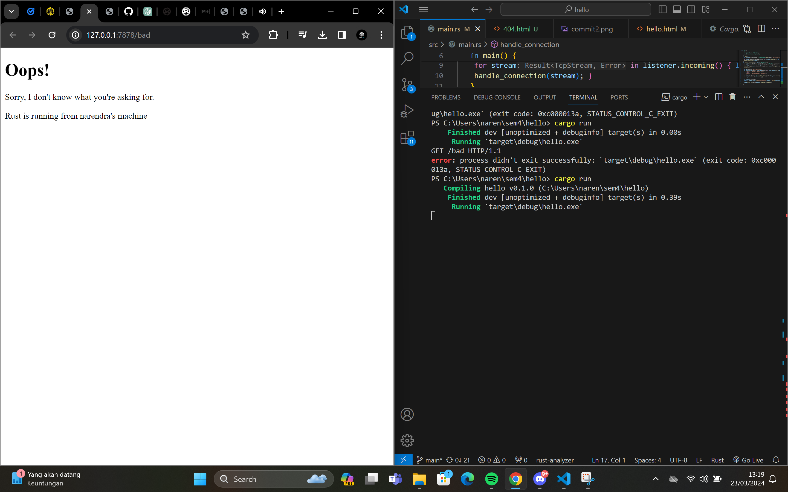

### Commit 1 Reflection notes
Method handle_connection membaca *http request* yang dikirimkan *client* lalu mencetaknya. Parameter *stream* dibungkus dalam BufReader agar dapat dibaca dengan efisien. Setelah itu, `buf_reader.lines()` akan membentuk *iterator* untuk setiap baris pada *stream*. Selanjutnya, untuk setiap result akan dipanggil method `unwrap()` pada `.map(|result| result.unwrap())` yang akan mengembalikan String dalam result jika resultnya Ok dan akan panik jika resultnya Err. `.take_while(|line| !line.is_empty())` akan terus mengambil baris dari *iterator* sampai barisnya kosong. Seteah itu, string-string yang didapatkan akan disimpan di dalam vector. Terakhir, string-string tersebut dicetak oleh program.

### Commit 2 Reflection notes

Method `handle_connection` yang baru memberikan *response* dari *request* yang diterima. Variabel `status_line`, `contents`, dan `length` adalah bagian-bagian dari *response* yang akan dikirimkan. Konten yang dikirimkan adalah bentuk String dari `hello.html`. Setelah diformat, response dikirimkan ke *client* pada kode `stream.write_all(response.as_bytes()).unwrap();`

### Commit 3 Reflection notes

Sebelumnya, program akan mengembalikan `hello.html` apapun bentuk requestnya. Oleh karena itu, pada program ditambahkan sebuah *conditional* untuk mengatasi request pada halaman yang tidak dikenali. Pada *chapter* 20, terdapat instruksi untuk implementasinya. Awalnya, terdapat banyak repetisi pada blok *conditional* yang diimplementasikan, yaitu blok `if` dan `else` melakukan *read* dan juga *write*. Oleh karena itu, dilakukan *refactoring* agar kode lebih ringkas.